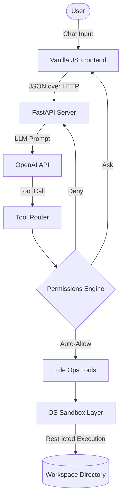

<div align="center">
  <h1>🛡️ AI Harness</h1>
  <p><b>The ultimate secure sandbox and execution environment for autonomous AI agents.</b></p>
</div>

<br/>

AI coding agents are powerful, but giving them raw terminal access is dangerous. They can accidentally wipe directories, push sensitive API keys, or spin up malicious processes. 

**AI Harness** is a robust, lightweight security layer and chat interface that lets you safely unleash agentic AI on your filesystem. By combining OS-level sandboxing (Seatbelt/Bubblewrap), granular human-in-the-loop permissions, and a beautiful zero-dependency vanilla JS frontend, AI Harness turns raw LLMs into production-grade autonomous assistants.

---

## ✨ Features

- **🔐 Ironclad OS-Level Sandboxing**  
  Uses native OS security features to create an impenetrable execution layer for the agent's shell commands:
  - **macOS:** Dynamically generated `sandbox-exec` (Seatbelt) profiles.
  - **Linux:** `bwrap` (Bubblewrap) with a virtualized `--tmpfs` overlay.
  - **Docker:** Fallback containerized execution environment.
  - *Result:* Blocks unauthorized network access, strictly confines reads/writes to the designated `Workspace` directory, and physically prevents the agent from reading or tampering with the harness's own source code.

- **🚦 Granular Permission Engine**  
  Not every action needs a sandbox. AI Harness intelligently routes tool calls:
  - **Auto-Allow:** Safe reads and standard workspace file edits are instantly approved.
  - **Human-in-the-loop (Ask/Confirm):** Destructive commands (e.g., `rm -rf`), outgoing network calls, or attempts to write outside the workspace pause execution and surface a beautiful in-chat "Allow/Reject" modal to the user.

- **🎨 "Claude-like" Minimalist UI**  
  No emojis. No clutter. Just a professional interface.
  - **Dynamic Grouping:** Automatically parses agent trajectories to collapse lengthy bash commands, internal monologues ("Thoughts"), and file edits into nested `<details>` dropdowns.
  - **Live Streaming:** Real-time feedback and state polling without page reloads.
  - **Zero-Dependency Frontend:** The entire frontend is just vanilla HTML, CSS, and JS. 

- **🛠️ Built-in Agent Toolchain**  
  Equips the LLM with a natively integrated toolset: 
  - `bash` (sandboxed execution)
  - `write_file` / `read_file` / `str_replace`
  - `list_dir` / `grep_search` / `glob_search`

---

## 🚀 Quick Start

### 1. Prerequisites
- Python 3.12+
- macOS (Seatbelt) or Linux (Bubblewrap/Docker)
- An OpenAI API Key

### 2. Installation
Clone the repository and install the dependencies:
```bash
git clone https://github.com/your-username/ai-harness.git
cd ai-harness
pip install -r requirements.txt
```

### 3. Environment Setup
Create a `.env` file in the root directory and add your API key:
```env
OPENAI_API_KEY=sk-your-key-here
```
*(By default, AI Harness creates a `../Workspace` folder adjacent to its own directory. The agent is strictly confined to this folder).*

### 4. Run the Harness
Start the FastAPI server:
```bash
python server.py
```
Open your browser to [http://localhost:8000](http://localhost:8000). You're ready to safely unleash your agent!

---

## 🏗️ Architecture



### Core Components
- `server.py`: The FastAPI event loop, session manager, and API endpoints.
- `sandbox.py`: The OS-level security translation layer (generates Seatbelt/Bwrap profiles on the fly).
- `permissions.py`: Evaluates the AST/arguments of tool calls to enforce safety rules and CWD constraints.
- `tools.py`: The suite of Python-native filesystem wrappers exposed to the LLM.

---

## 💻 Tech Stack

- **Backend:** Python, FastAPI, Uvicorn, Pydantic
- **AI Integration:** OpenAI Python SDK
- **Frontend:** HTML5, CSS3, Vanilla JavaScript, Marked.js (Markdown parsing), Highlight.js
- **Security:** `sandbox-exec` (macOS), `bubblewrap` (Linux)

---

<div align="center">
  <i>Built with focus and coffee for the Hackathon.</i>
</div>
